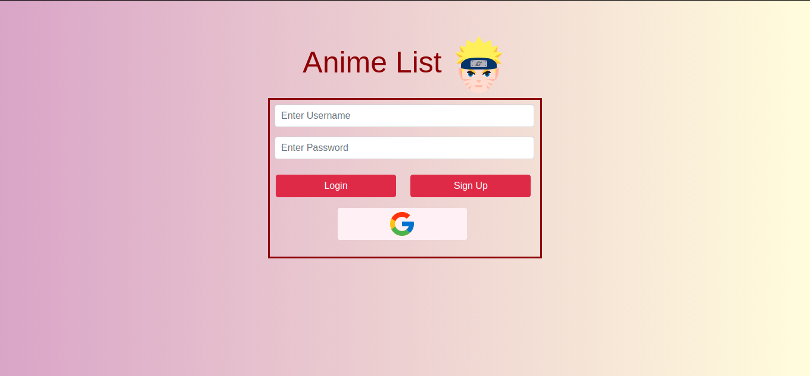

# Anime-List
## Installation guide :
&nbsp; 1: Install Anaconda from : https://www.anaconda.com/products/individual  
&nbsp; 2: Install environment from requirements.txt file  using command :  
### &nbsp; &nbsp; conda env create --file requirements.txt 
&nbsp; Get a list of environments: < br />
### &nbsp; &nbsp;  conda env list
&nbsp;To activate environment :
### &nbsp; &nbsp;  conda activate env_name  

